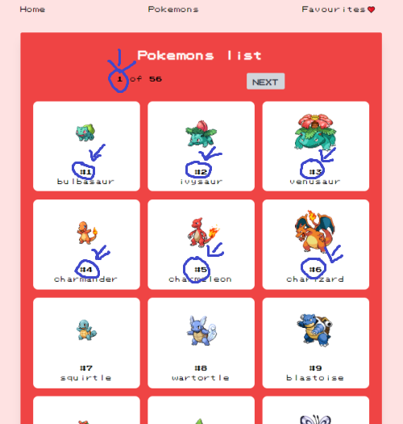
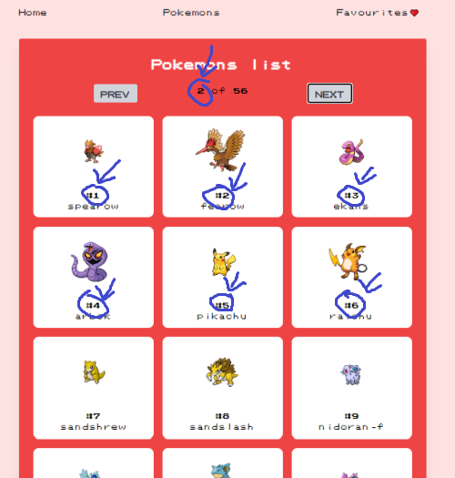
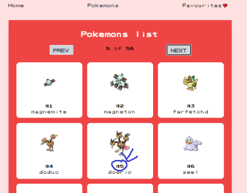
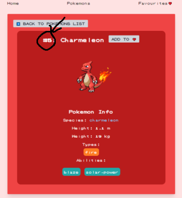
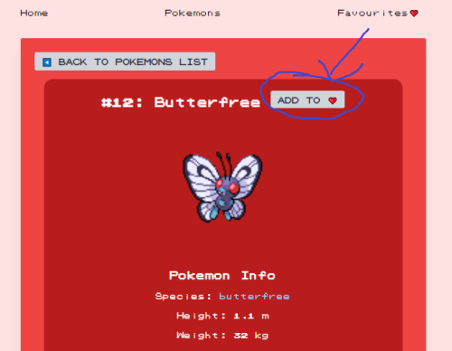
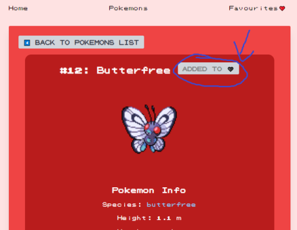

## Pokedex - bug report

### These are the issues that need to be fixed:

1. The IDs of the pokemons do not change or increment when clicked on the 'NEXT' button to see another twenty pokemons in the Pokemons List section.

 

2. The above is an aftermath of another issue: when clicked on a specific pokemon from the Pokemons List section (it does not matter from which page it is clicked on: 10, 23 or 47, the issue is the same) to get into the pokemon's details card, it redirects to a different pokemon that is not corresponding with an image and name of the pokemon from the page it was clicked on but shows a pokemon that has a number from a list as an actual ID number.

 

3. Issue with an "Add to Favourite" button that is on the page with pokemon's details card: namely, when clicked on the button to add a pokemon to favourites, the button is disabled (and a message on a button changes to indicate that it was already added to favourites) in order to prevent a user from adding the same pokemon again but when you go back to the Pokemons List section and click on the same pokemon to get redirected to the details of this pokemon, the button is enabled again instead of staying disabled.

 

